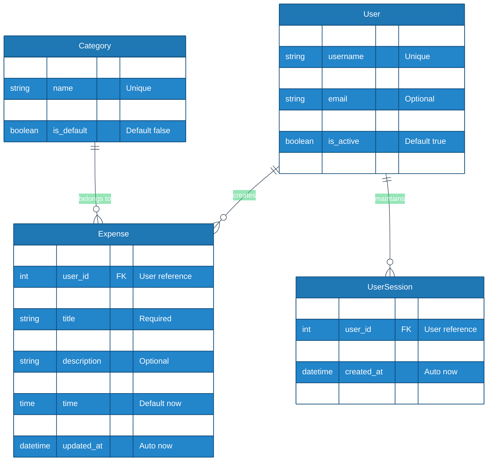
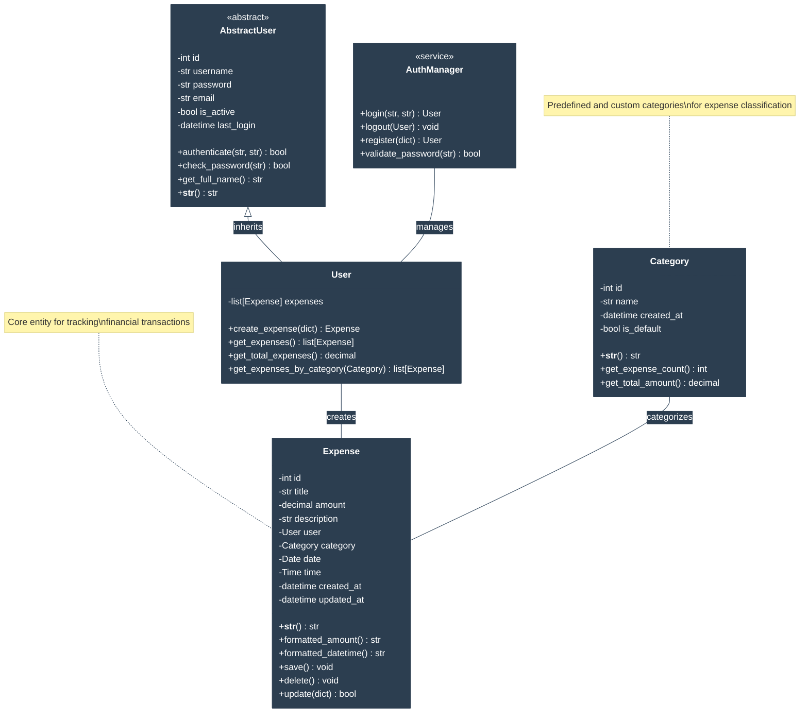
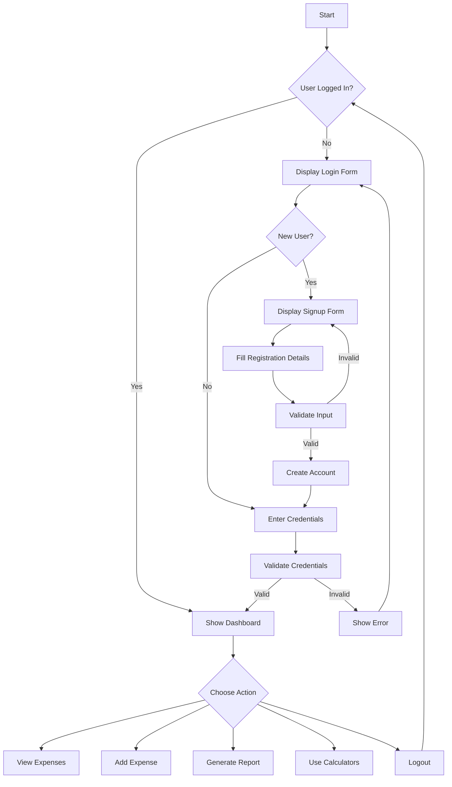
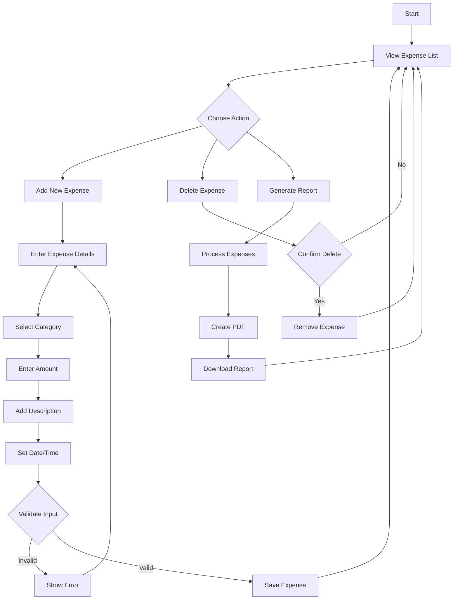
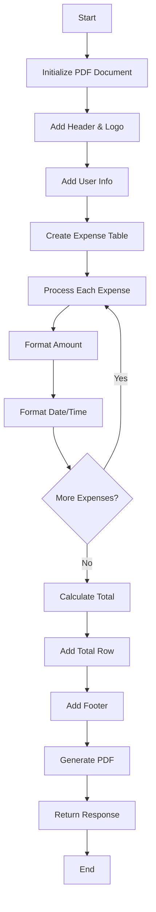
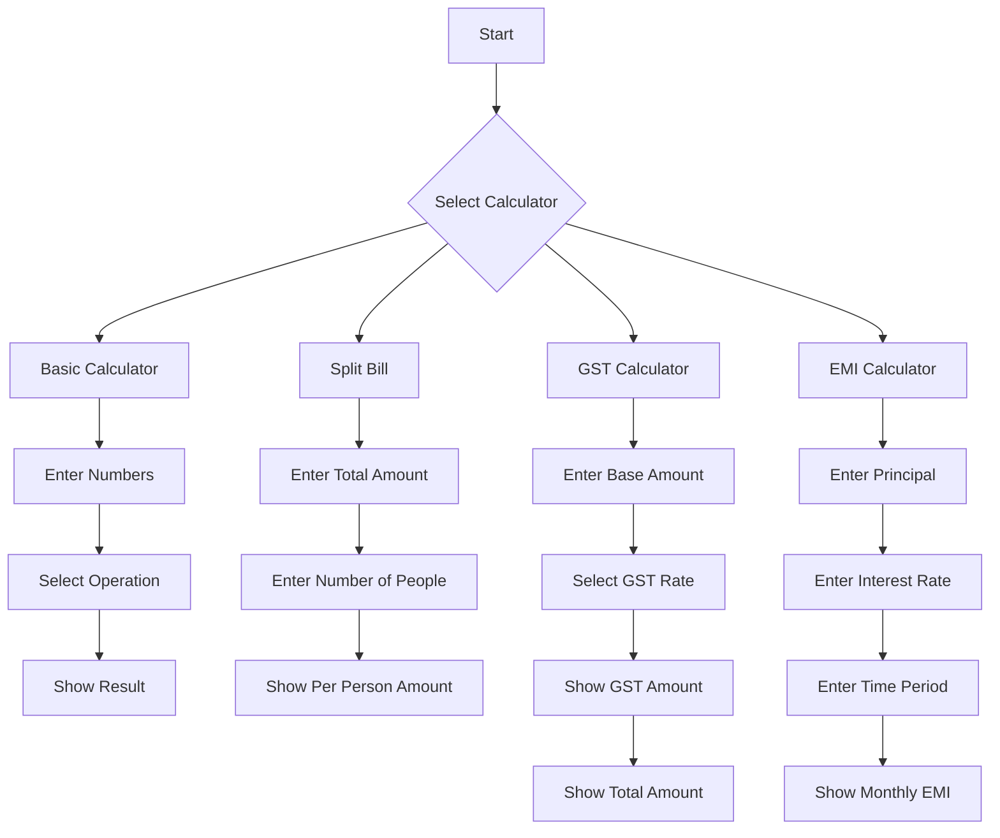

# Expense Tracker - System Diagrams

## 1. Entity Relationship (ER) Diagram


## 2. UML Class Diagram


## 3. User Authentication Workflow


## 2. Expense Management Workflow


## 3. PDF Generation Process


## 4. Financial Calculator Flow


## How to Use These Flowcharts

1. These flowcharts are written in Mermaid.js format
2. To view them:
   - Use VS Code with Mermaid extension
   - Visit https://mermaid.live
   - Use any Markdown editor that supports Mermaid
3. To edit:
   - Edit the text between the ```mermaid tags
   - The syntax is simple and intuitive:
     - A --> B creates a flow from A to B
     - {text} creates a decision diamond
     - [text] creates a process box
     - |text| on arrows adds labels

## Flowchart Color Scheme Suggestions

For better visualization, you can add these styles in Mermaid:

```mermaid
%%{init: {'theme': 'base', 'themeVariables': {
    'primaryColor': '#2c3e50',
    'primaryTextColor': '#fff',
    'primaryBorderColor': '#2c3e50',
    'lineColor': '#2c3e50',
    'secondaryColor': '#e74c3c',
    'tertiaryColor': '#18bc9c'
}}}%%
```

This will match your application's color scheme.