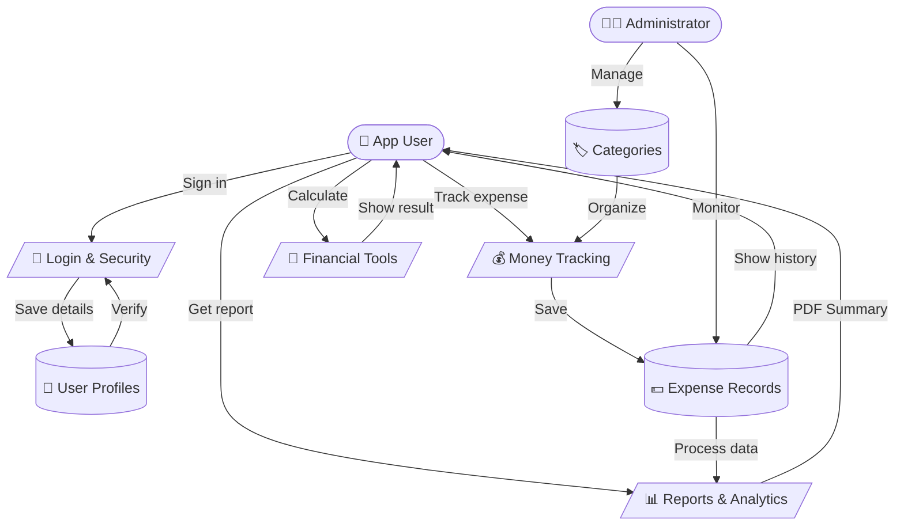
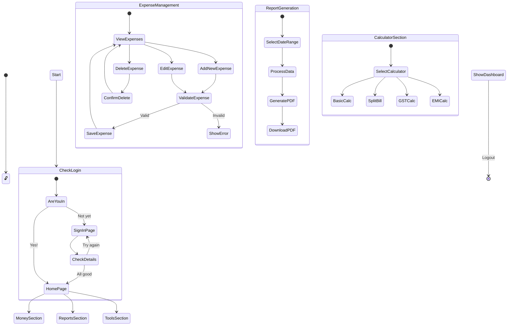
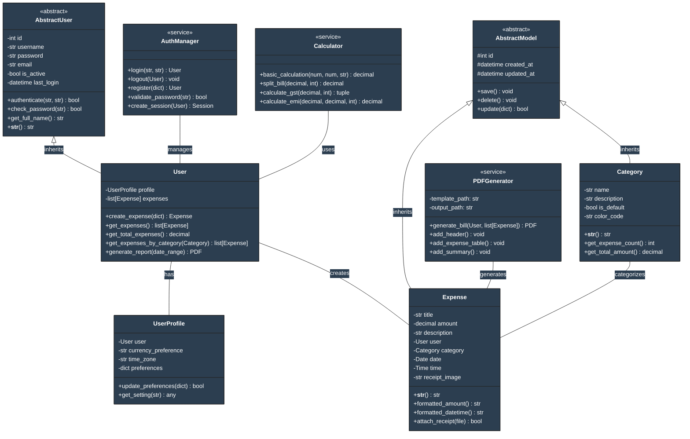
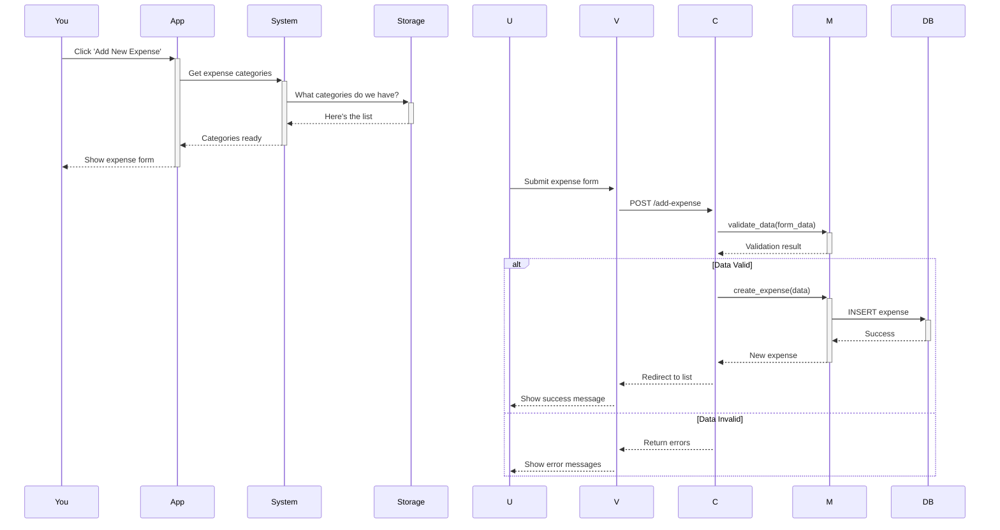

# Expense Tracker - Professional System Diagrams

## 1. Data Flow Diagram (DFD)


## 2. Enhanced ER Diagram
```mermaid
%%{init: {
  'theme': 'base',
  'themeVariables': {
    'primaryColor': '#4B0082',
    'primaryTextColor': '#fff',
    'primaryBorderColor': '#4B0082',
    'lineColor': '#483D8B',
    'secondaryColor': '#6A5ACD',
    'tertiaryColor': '#9370DB'
  }
}}%%
graph LR
    %% Entity Styling
    classDef entity fill:#4B0082,stroke:#483D8B,stroke-width:2px,color:white
    classDef attribute fill:#9370DB,stroke:#483D8B,stroke-width:1px,color:white
    
    %% User Entity and Attributes
    User[((👤 USER))]:::entity
    UserId["🔑 id (PK)"]:::attribute
    UserName["👤 username"]:::attribute
    UserPass["🔒 password"]:::attribute
    UserEmail["📧 email"]:::attribute
    UserStatus["✅ is_active"]:::attribute
    
    User --- UserId
    User --- UserName
    User --- UserPass
    User --- UserEmail
    User --- UserStatus

    %% Expense Entity and Attributes
    Expense[((💰 EXPENSE))]:::entity
    ExpId["🔑 id (PK)"]:::attribute
    ExpAmount["💵 amount"]:::attribute
    ExpTitle["📝 title"]:::attribute
    ExpDate["📅 date"]:::attribute
    ExpDesc["📄 description"]:::attribute
    ExpReceipt["🧾 receipt_image"]:::attribute

    Expense --- ExpId
    Expense --- ExpAmount
    Expense --- ExpTitle
    Expense --- ExpDate
    Expense --- ExpDesc
    Expense --- ExpReceipt

    %% Category Entity and Attributes
    Category[((🏷️ CATEGORY))]:::entity
    CatId["🔑 id (PK)"]:::attribute
    CatName["📋 name"]:::attribute
    CatDesc["📝 description"]:::attribute
    CatDefault["⭐ is_default"]:::attribute
    CatColor["🎨 color_code"]:::attribute

    Category --- CatId
    Category --- CatName
    Category --- CatDesc
    Category --- CatDefault
    Category --- CatColor

    %% UserProfile Entity and Attributes
    Profile[((👔 USER_PROFILE))]:::entity
    ProfId["🔑 id (PK)"]:::attribute
    ProfCurrency["💱 currency"]:::attribute
    ProfZone["🌍 timezone"]:::attribute
    ProfPrefs["⚙️ preferences"]:::attribute

    Profile --- ProfId
    Profile --- ProfCurrency
    Profile --- ProfZone
    Profile --- ProfPrefs

    %% Session Entity and Attributes
    Session[((🔐 USER_SESSION))]:::entity
    SessId["🔑 id (PK)"]:::attribute
    SessKey["🔒 session_key"]:::attribute
    SessDevice["📱 device_info"]:::attribute
    SessIP["🌐 ip_address"]:::attribute

    Session --- SessId
    Session --- SessKey
    Session --- SessDevice
    Session --- SessIP

    %% Relationships
    User ==>|"Creates 1:N"| Expense
    User ==>|"Has 1:1"| Profile
    User ==>|"Has 1:N"| Session
    Category ==>|"Has N:1"| Expense
```

## 3. Use Case Diagram
```mermaid
%%{init: {
  'theme': 'base',
  'themeVariables': {
    'primaryColor': '#2c3e50',
    'primaryTextColor': '#fff'
  }
}}%%
graph TB
    %% Main Users
    User((👤 Regular User))
    Admin((👨‍💼 Admin))
    Storage[(📁 Storage)]
    Auth[[🔐 Security]]
    Reports[[📄 Reports]]
    Mail[[📧 Email]]

    subgraph What Users Can Do
        %% Account Features
        subgraph Getting Started
            SignIn[🔑 Sign In]
            NewAccount[✨ Create Account]
            Password[🔄 Reset Password]
            Settings[⚙️ My Settings]
        end

        %% Money Management
        subgraph Money Tracking
            AddMoney[💰 Add Expense]
            UpdateMoney[✏️ Edit Details]
            RemoveMoney[🗑️ Remove Entry]
            ViewMoney[👀 View History]
            TagMoney[🏷️ Add Tags]
            FindMoney[🔍 Search]
        end

        %% Reports
        subgraph Insights
            GetPDF[📊 Download Report]
            SeeStats[📈 View Stats]
            SaveData[💾 Export Data]
            FilterData[🔍 Filter View]
        end

        %% Tools
        subgraph Helpful Tools
            Calculator[➕ Basic Math]
            SplitMoney[👥 Split Bills]
            TaxCalc[💸 GST Helper]
            LoanCalc[📱 EMI Helper]
        end

        %% Tags
        subgraph Organize
            NewTag[➕ New Tag]
            ChangeTag[✏️ Edit Tag]
            RemoveTag[❌ Remove Tag]
        end
    end

    %% User Interactions
    User --> Login
    User --> Register
    User --> ManageProfile
    User --> AddExpense
    User --> ViewExpenses
    User --> GeneratePDF
    User --> ViewAnalytics
    User --> Financial Tools

    %% Admin Interactions
    Admin --> Category Management
    Admin --> ViewAnalytics
    Admin --> ExportData

    %% Database Interactions
    AddExpense --> DB
    EditExpense --> DB
    DeleteExpense --> DB
    ViewExpenses --> DB
    AddCategory --> DB
    ViewAnalytics --> DB

    %% Authentication System
    Login --> AuthSystem
    Register --> AuthSystem
    ResetPassword --> AuthSystem
    AuthSystem --> DB

    %% Service Interactions
    GeneratePDF --> PDFService
    ResetPassword --> EmailService

    %% Include Relationships
    ViewExpenses -.-> SearchExpense
    AddExpense -.-> CategorizeExpense
    EditExpense -.-> CategorizeExpense
    GeneratePDF -.-> FilterReports

    %% Notes
    classDef note fill:#ffffcc,stroke:#black,stroke-width:1px
    class DB,AuthSystem,PDFService,EmailService note
```

## 4. Activity Diagram


## 5. Enhanced Class Diagram


## 6. Sequence Diagram (Expense Creation Flow)


## Notes on Using These Diagrams

1. Each diagram serves a specific purpose:
   - DFD: Shows data movement through the system
   - ER Diagram: Database structure and relationships
   - Use Case: System functionality from user perspective
   - Activity: System workflow and processes
   - Class: Object-oriented design structure
   - Sequence: Interaction between components

2. Color Scheme:
   - Primary: #2c3e50 (Dark Blue)
   - Secondary: #3498db (Light Blue)
   - Tertiary: #18bc9c (Teal)
   - Text on Dark: #ffffff (White)
   - Lines: #34495e (Gray Blue)

3. Viewing Instructions:
   - Use VS Code with Mermaid extension
   - Or visit https://mermaid.live
   - Keep diagrams updated as system evolves

4. Key Features Highlighted:
   - Authentication & Authorization
   - Expense Management
   - Report Generation
   - Calculator Functions
   - Data Validation
   - Error Handling